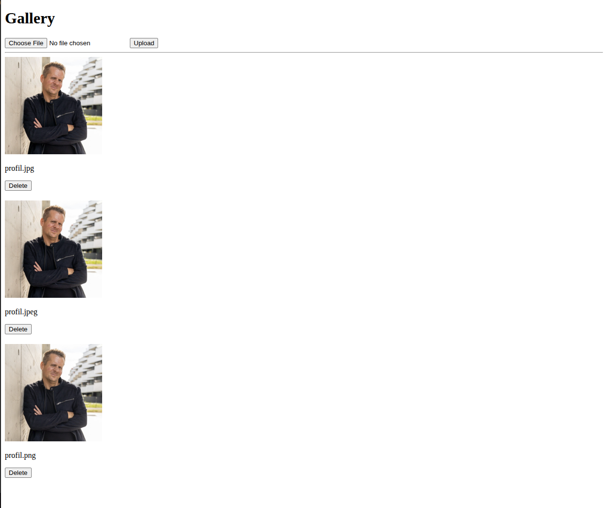

# Photo Archive

A lightweight **photo archive application** built with **Flask** and **Docker**.

The project provides a simple web-based interface for managing and displaying photographs in a containerized environment.

---

## Screenshots




---

## Technology Stack

| Technology         | Purpose                   |
| ------------------ | ------------------------- |
| **Python**         | Application logic         |
| **Flask**          | Web application framework |
| **Docker**         | Containerization          |
| **Docker Compose** | Local deployment          |

---

## Getting Started

### Requirements

* Docker
* Docker Compose

Clone the repository:

```bash id="j9y3cr"
git clone https://github.com/CodeByMaxx/photo-archive.git
cd photo-archive
```

Start the application:

```bash id="m6k2wd"
docker compose up --build
```

After the containers have started, access the application through the exposed web port.

---

## Project Structure

```text id="f1t7qz"
photo-archive
│
├── Dockerfile
├── docker-compose.yml
├── requirements.txt
├── README.md
│
└── application source
```

---

## Project Goals

The project was created to explore a simple, containerized web application using Python and Flask.

The main focus is on:

* Flask web development
* Containerization with Docker
* Reproducible application deployment
* Simple photo management
* Web-based presentation of archived images

---

## Docker

Docker provides an isolated and reproducible environment for running the application.

Using Docker Compose makes it possible to start the application with a single command:

```bash id="f5m7x2"
docker compose up --build
```

This keeps the local development and deployment workflow simple and consistent.

---

## Future Improvements

Possible improvements include:

* [ ] Improved photo metadata
* [ ] Search and filtering
* [ ] Categories and tags
* [ ] Improved image management
* [ ] Authentication
* [ ] Persistent external storage
* [ ] Improved responsive UI

---

## License

This project is licensed under the **MIT License**.

